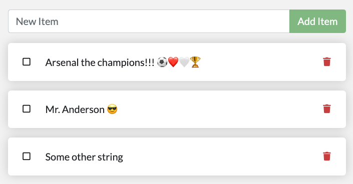

# Docker Volume Mount Example

## Description

This repository represents a simple Javascript web application.  
Originally taken from the very basic Docker `getting-started` image.  
This app holds a very simple database where you can add/remove strings in it, nothing too smart.  
  
The purpose of this project is to show the `Docker Volume Mount` concept and use case.  
The way to show this is to run the Docker container twice: once [without any volume mount](#second-step-run-the-container-with-no-volume-mount), and the other [with it](#third-step-run-the-container-with-the-volume-mount), and then compare results between them.  

### Screenshot


### Prerequisites
* Docker

### Usage
#### First step: build the docker image
```bash
git clone https://github.com/mr-anderson86/docker-volumemount-example.git
cd docker-volumemount-example
docker build -t simple-db .
docker images
# You'll see that the image you've built just now
```
<br/>

#### Second step: run the container with no volume mount
```bash
docker run --name my-app -d -p 3000:3000 simple-db
```
* Access the web page at http://localhost:3000
* Add a few strings
* then delete the container and recreate it  
  ```bash
  docker rm -f my-app
  docker run --name my-app -d -p 3000:3000 simple-db
  ```
* Access again the web page at http://localhost:3000  
  Do you see your previous data, or is it deleted?

<br/>

#### Third step: run the container with the volume mount
The database is held within the container at `/app/todos/todo.db`,  
so we can either mount the file itself to the host, or the whole dirrectory.  
We're going to mount the whole directory:
```bash
# First, delete the previous app, then make an empty dir wherever you want
docker rm -f my-app

# Then run the container with mounting the host directory (it will create 'data' directory here) into the DB dir in the container as follows:
docker run --name my-app -d -p 3000:3000 -v $(pwd)/data:/app/todos simple-db
```
* Access the web page at http://localhost:3000
* Add a few strings
* See that the data is now synced into your computer under the `data` directory:  
  ```bash
  ls ./data
  # todo.db
  ```
* then delete the container and recreate it  
  ```bash
  docker rm -f my-app
  docker run --name my-app -d -p 3000:3000 -v $(pwd)/data:/app/todos simple-db
  ```
* Access again the web page at http://localhost:3000  
  Do you see your previous data now? :-)
  
### Cleanup
```bash
docker rm -f my-app
docker rmi simple-db

# Cleanup data, be careful - cannot be returnd
rm -rf data
```

### The end, enjoy :-)